# orchestra

> A multi-agent AI CLI for engineers who want a team, not a chatbot.

[](https://go.dev/)
[](https://opensource.org/licenses/MIT)
[](https://goreportcard.com/report/github.com/yubzen/orchestra)
[](https://github.com/yubzen/orchestra/releases)

`orchestra` is an open-source terminal interface that orchestrates a team of specialized AI agents — Planner, Coder, Reviewer, and Analyst — to work on your codebase together. It does semantic indexing of your repo, scrubs your secrets before they reach any API, and can run headless on a VPS while you sleep.

It is not a wrapper around a single model. It is an agent control plane.

---

## Why Orchestra?

| Feature | orchestra | Cursor | Aider | OpenCode |
|---|---|---|---|---|
| Multiple specialized agents | ✅ | ❌ | ❌ | ❌ |
| Role-based tool permissions | ✅ | ❌ | ❌ | ❌ |
| Local semantic RAG indexing | ✅ | ✅ | ❌ | ❌ |
| Secret scrubbing middleware | ✅ | ❌ | ❌ | ❌ |
| VPS headless mode | ✅ | ❌ | ❌ | ❌ |
| Open `/roles` extension system | ✅ | ❌ | ❌ | ❌ |
| Provider agnostic | ✅ | ❌ | ✅ | ✅ |
| 100% open source | ✅ | ❌ | ✅ | ✅ |

---

## Architecture

```mermaid
flowchart TD
    User(["👤 User"])
    TUI["TUI (Bubbletea)"]
    Dispatcher["Dispatcher (Go)"]
    RAG["RAG Indexer\n(sqlite-vec + local index + nomic-embed-text)"]
    State["State Engine\n(SQLite)"]
    Scrubber["Secret Scrubber"]

    Planner["🗂 Planner Agent\nRead-only · YAML output"]
    Coder["⚙️ Coder Agent\nFull write access"]
    Reviewer["🔍 Reviewer Agent\nRead-only · JSON findings"]
    Analyst["📊 Analyst Agent\nRead-only · Markdown reports"]

    User -->|prompt| TUI
    TUI -->|command| Dispatcher
    Dispatcher -->|context injection| RAG
    RAG -->|top-5 chunks| Dispatcher
    Dispatcher -->|sanitized messages| Scrubber
    Scrubber --> Planner & Coder & Reviewer & Analyst
    Planner -->|ExecutionPlan.yaml| Dispatcher
    Coder -->|source code| Dispatcher
    Reviewer -->|ReviewResult.json| Dispatcher
    Analyst -->|FeatureReport.md| Dispatcher
    Dispatcher <--> State
    Dispatcher --> TUI
```



---

## Quick Start

### Install

```bash
go install github.com/yubzen/orchestra@latest
```

Or download a pre-built binary from [Releases](https://github.com/yubzen/orchestra/releases).

### Setup

```bash
# Start TUI
cd your-project/
orchestra

# Connect providers from inside TUI
# 1) /connect
# 2) Select provider
# 3) Select auth method
# 4) Enter API key

# Pick role models from connected providers
# /models
```

### Map a codebase (no API calls required for read)

```bash
orchestra map ./internal/auth
# Outputs: FeatureReport.md with Mermaid diagrams, file map, and logic trace
```

### Run headless on a VPS

```bash
orchestra serve --headless --webhook https://hooks.slack.com/your-url
# Agents continue working. You get a Slack notification when done.
```

### CLI Infrastructure Commands

```bash
# Provider credential management
orchestra auth list
orchestra auth set openai --key sk-...
orchestra auth remove openai

# Remote attach scaffold
orchestra attach https://orchestra.your-vps.dev/session/abc123

# MCP registry management
orchestra mcp add figma --cmd npx --arg -y --arg @modelcontextprotocol/server-figma
orchestra mcp list

# Usage dashboard
orchestra stats

# Session/state controls
orchestra session list
orchestra session resume <session-id>
orchestra -s <session-id>
orchestra db
orchestra db query "SELECT id, mode FROM sessions ORDER BY created_at DESC LIMIT 10"
orchestra db clear-index

# State portability
orchestra export --out orchestra-state.json
orchestra import orchestra-state.json --merge

# Workflow utilities
orchestra agent list
orchestra agent create security-auditor
orchestra models
orchestra pr 123 --repo your-org/your-repo
```

---

## The Agent Team

Each agent is isolated — its own system prompt, its own model, its own tool permissions. Agents cannot exceed their role.

### Planner
Reads the codebase. Outputs an `ExecutionPlan.yaml` that the Orchestrator uses to sequence work. **Cannot write files.**

### Coder
Receives one task at a time from the plan. Writes code, runs only what the task requires. Reports completion as structured JSON.

### Reviewer
Reads the Coder's output. Checks for nil dereferences, unhandled errors, SQL injection, hardcoded secrets, race conditions. Returns `{"approved": bool, "findings": [...]}`. **Cannot write files.**

### Analyst
Traces data flow across your repo. Returns a Markdown report with a Mermaid sequence diagram. **Cannot write files. Cannot execute commands.**

---

## TUI Reference

```
[ROLE: CODER] | [MODEL: no-model-selected] | [CTX: 0%]
```

| Command | Action |
|---|---|
| `/roles` | Open role picker modal |
| `/models` | Open model picker for current role (only from connected providers) |
| `/connect` | Connect providers and store API keys in keyring |
| `/compact` | Summarize chat history → long-term memory block, free context |
| `/mcps` | Show active MCP connections and status |
| `/status` | Token spend, API health, session uptime dashboard |

### Keyboard UX

- Type `/` to show up to 6 commands.
- Type partial command text (`role`, `/mod`, etc.) to filter.
- First match is preselected by default.
- Use `up/down` to move selection.
- Press `enter` to execute selected command.
- Press `tab` to autocomplete selected command.
- Press `shift+tab` to cycle active role (loops).

### Role & Model Behavior

- Roles are independent (`CODER`, `REVIEWER`, `PLANNER`).
- Each role has its own selected model.
- If a role has no model, status bar shows `no-model-selected`.
- Prompts are blocked until at least one model is selected.
- In orchestrated mode, planner/coder/reviewer all need models.
- If no usable model is selected, Orchestra returns: `no AI selected`.

### Provider Connection Flow

- Run `/connect` in TUI.
- Select provider (`Anthropic`, `OpenAI`, `Google`, `xAI`).
- Select auth method.
  - `OpenAI` currently shows:
    - `ChatGPT Pro/Plus (browser)` (placeholder)
    - `ChatGPT Pro/Plus (headless)` (placeholder)
    - `Manually enter API Key` (active)
  - Other providers currently show:
    - `Manually enter API Key` (active)
- Enter API key in modal and submit.
- Keys are stored in OS keyring (`go-keyring`) and reused on next launch.
- `/models` only lists models from providers that are already connected.

---

## CLI Command Set

### Core Infrastructure Commands

- `orchestra serve`: headless runtime for long-cycle orchestration.
- `orchestra attach <url>`: validate and prepare remote session attach target.
- `orchestra auth`: centralized provider key manager (`list`, `set`, `remove`) using OS keyring.
- `orchestra mcp`: MCP registry manager (`list`, `add`, `remove`, `enable`, `disable`).
- `orchestra stats`: SQLite usage dashboard (sessions, messages, tokens by role).
- `orchestra session`: session lifecycle helpers (`list`, `manage`, `resume`).
- `orchestra db`: state store tooling (`path`, `query`, `clear-index`, `vacuum`).
- `orchestra export`: export sessions/messages/memory/task results to JSON.
- `orchestra import`: import exported state JSON back into SQLite (merge or replace).

### Workflow Commands

- `orchestra agent list`: list available role directories under `/roles`.
- `orchestra agent create <name>`: scaffold new role (`persona.md`, `tools.json`).
- `orchestra pr <number>`: generate a PR review scaffold report.
- `orchestra models [provider]`: list models for connected providers (`--all` supported).

### Current Notes

- `attach` currently validates target URL and provides attach scaffold output.
- `pr` currently scaffolds a review report artifact; live GitHub pull/analysis is a next step.
- `models` prefers provider-listed models when reachable, otherwise falls back to built-in catalog.
- `auth` and TUI `/connect` both use the same keyring storage (`orchestra` service).
- `session resume` currently resolves and prints session context; transport/runtime reattach remains next.
- RAG uses statically linked `sqlite-vec` bindings; local vector data is stored in `orchestra_vec.db`.

### TUI Experience Targets (Planned)

- Multi-modal status bar: active specialist + model + context percentage.
- Breadcrumb navigation: visualize handoff path (Architect -> Planner -> Coder).
- Compact trigger: one action to summarize memory when context is near saturation.
- Live log streaming toggle: show inner orchestration/MCP events for debugging.

---

## Extending orchestra: Custom Roles

The `/roles` system is the core extension point. To add a custom role:

```
roles/
└── security-auditor/
    ├── persona.md     ← system prompt for this agent
    └── tools.json     ← which MCP tools this role can access
```

**Example `tools.json` (read-only security auditor):**
```json
{
  "allowed": ["read_file", "list_dir", "search_files"],
  "denied": ["write_file", "run_command", "delete_file"]
}
```

**Example `persona.md`:**
```markdown
# Role: Security Auditor
# Mission: Find vulnerabilities. Never modify code.

## Directives:
1. Check for OWASP Top 10 patterns.
2. Flag hardcoded credentials, insecure defaults, missing auth.
3. Mark uncertain findings as [NEEDS_HUMAN_REVIEW].
4. Output as JSON: {"severity": "critical|high|medium|low", "file": "", "line": 0, "description": ""}
```

Share your role folder — it "just works" inside any `orchestra` installation.

---

## Configuration

Config lives at `~/.config/orchestra/config.toml`. Managed via `orchestra config`.

```toml
[defaults]
mode = "solo"           # solo | orchestrated
working_dir = "."

[providers.anthropic]
default_model = "claude-opus-4"

[providers.google]
default_model = "gemini-2.5-pro"

[providers.openai]
default_model = "codex-5"
base_url = "https://api.openai.com/v1"  # override for OpenAI-compatible endpoints

[rag]
enabled = true
embedder = "nomic-embed-text"
ollama_url = "http://localhost:11434"
chunk_size = 512
chunk_overlap = 64
```

API keys are **never stored in this file.** They are stored in your OS native keyring via `go-keyring`.

---

## Secret Scrubbing

Every string that leaves the process through an LLM call is passed through the scrubber. This includes user prompts, RAG-injected code chunks, and file contents.

Patterns scrubbed automatically:
- `.env` style keys: `SECRET_KEY=abc123` → `SECRET_KEY=[REDACTED]`
- OpenAI keys: `sk-...` → `[REDACTED_KEY]`
- Google keys: `AIza...` → `[REDACTED_KEY]`
- GitHub tokens: `ghp_...` → `[REDACTED_KEY]`
- JWT tokens: `eyJ...` → `[REDACTED_JWT]`

---

## Orchestration Flow

When you run `orchestra --orchestrate` and give a complex prompt:

```
1. Planner reads your repo → outputs ExecutionPlan.yaml
2. Dispatcher parses plan into sequential/parallel Steps
3. For each Step:
   a. Coder executes the task
   b. Reviewer audits the output
   c. If rejected: Coder retries with findings injected (max 2 retries)
   d. If still failing: Step marked BLOCKED, you are notified
4. TUI shows live agent status per step
5. On completion: session saved to SQLite, webhook fires if configured
```

---

## VPS / Headless Mode

```bash
orchestra serve --headless \
  --session my-feature \
  --webhook https://discord.com/api/webhooks/YOUR_WEBHOOK
```

---

## Requirements

- Go 1.22+
- [Ollama](https://ollama.ai) (for local RAG embeddings — optional but recommended)
- At least one provider API key (Anthropic, Google, OpenAI-compatible)
- SQLite (bundled via `mattn/go-sqlite3`, CGO required)

---

## License

MIT — see [LICENSE](LICENSE) for full text. You can use this in commercial projects, fork it, modify it, and redistribute it. Attribution appreciated but not required.
